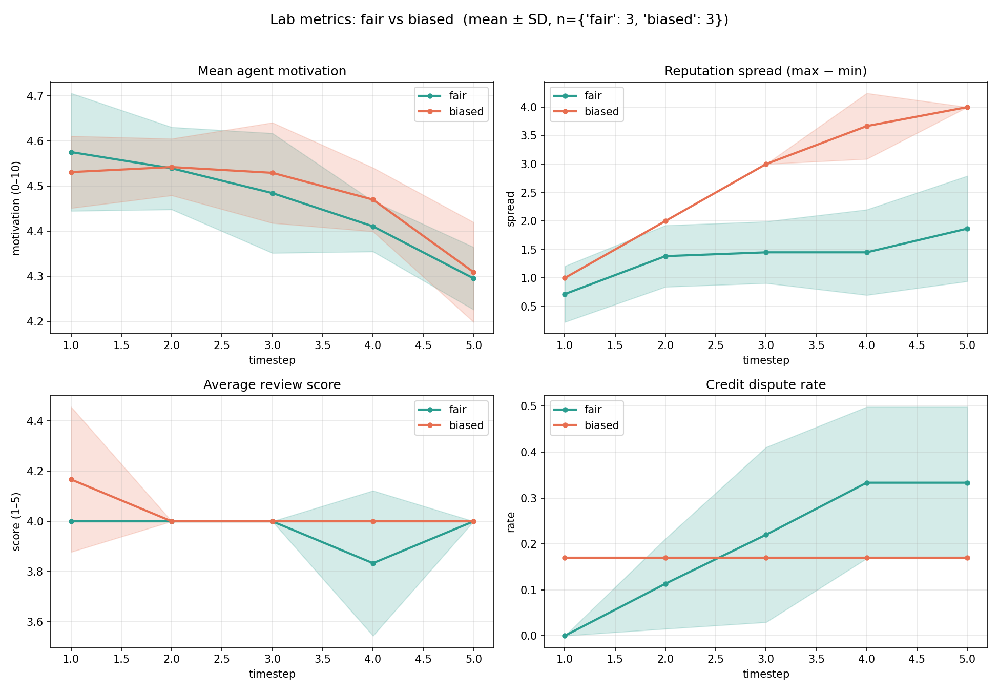

# Labsim

> A RAG-grounded multi-agent simulation of a research lab, built to study how a
> PI's fairness shapes credit, motivation, and opportunity — paired with a full
> RAG/LLM engineering and evaluation stack.

Agents (PhD students, postdocs, a PI) discuss problems, write papers,
peer-review each other, and accrue motivation and reputation over time. Every
agent response is grounded in that agent's own private knowledge base via
retrieval-augmented generation.

## Tech stack

| Layer | Tools |
|-------|-------|
| LLM / embeddings | Ollama (llama3.2, nomic-embed-text); model-agnostic client for OpenAI / Anthropic |
| Retrieval | ChromaDB (vector), rank-bm25 (keyword), reciprocal rank fusion, cross-encoder reranker (bge-reranker) |
| Structured LLM I/O | JSON-schema-constrained outputs, ReAct-style tool calling |
| Observability | SQLite tracing (latency, tokens per call) |
| Evaluation | precision@k / recall@k / MRR; LLM-as-judge faithfulness & hallucination |
| Experiments / plots | NumPy, Matplotlib (multi-seed, error-banded) |
| Testing | unittest (offline, mocked LLM) |

## Results

- **Hybrid retrieval beats single-method retrieval.** On a corpus with
  distractor documents, hybrid (BM25 + vector, fused via RRF) reached
  **MRR 1.000** vs 0.958 for vector-only or BM25-only ranking the correct
  document first on every query.
- **Context quality drives faithfulness.** Enriching retrieved context from
  one-line stubs to abstract-length passages cut hallucination on answerable
  questions from **0.70 to 0.07**.
- **PI bias concentrates credit.** Averaged over seeds, reputation spread
  (max − min) climbs to **~4.0 under a biased PI** vs **~1.5 under a fair PI** —
  a fair PI rotates leadership across all agents, a biased PI funnels it to one.



*Fair vs biased PI, mean ± SD over 3 seeds. Top-right: reputation spread
diverges — credit concentrates under bias.*

## Requirements

- Python 3.10+
- [Ollama](https://ollama.ai) running locally

```bash
# Terminal 1: start the model server (or: brew services start ollama)
ollama serve

# Pull models
ollama pull llama3.2          # generation + LLM-as-judge
ollama pull nomic-embed-text  # embeddings

# Terminal 2: set up the environment
python -m venv .venv
source .venv/bin/activate
pip install -r requirements.txt
```

## Quick start

```bash
# Fair PI (merit + equity based assignment)
python run_sim.py --students 3 --postdocs 2 --timesteps 5 --fairness 1.0 --model llama3.2

# Biased PI favoring agent 0 (a junior student)
python run_sim.py --students 3 --postdocs 2 --timesteps 5 --fairness 0.2 --pi-favorite 0 --model llama3.2
```

A per-agent LLM trace summary (latency, tokens) prints at the end. A plot is
saved to `lab_sim_results.png`.

## Running the experiment

A single run is noisy, so average over seeds:

```bash
python run_experiment.py --seeds 3 --timesteps 5 --model llama3.2 --conditions fair
python run_experiment.py --seeds 3 --timesteps 5 --model llama3.2 --conditions biased
python plot_experiment.py
```

Writes per-seed histories under `experiments/` and produces two figures:
`compare_lab_metrics.png` and `compare_motivation_by_role.png`.

## Evaluating the RAG pipeline

**Retrieval quality** (precision@k, recall@k, MRR) across vector / BM25 / hybrid
modes, on a corpus with distractor documents:

```bash
python run_rag_eval.py --k 3
python run_rag_eval.py --k 3 --rerank   # add the cross-encoder reranker
```

**Faithfulness / hallucination** - has an agent answer questions from its KB,
then judges whether answers stay grounded. Compares three modes: ungrounded,
grounded (prompt instruction), and grounded + retrieval-time abstention:

```bash
python run_faithfulness_eval.py --model llama3.2
```

Note: this uses llama3.2 to judge llama3.2 and a small question set, so numbers
are indicative and vary run to run. For a firm claim, average over several runs.

## How fairness works

The PI's `fairness` parameter (0–1) controls opportunity distribution in
`assign_problem()` (`agents/pi.py`):
- **High fairness** -  under-used agents get an equity boost and selection is
  softmax-sampled, so leadership spreads across everyone, including students.
- **Low fairness** - selection is argmax-greedy and concentrates on the favorite.

## How RAG works

```
query ─┬─ vector search (nomic-embed-text)
       └─ BM25 keyword search
              │
     reciprocal rank fusion
              │
   [optional] cross-encoder reranker
              │
   [optional] abstention (drop if best similarity < threshold)
              │
           top-k chunks
```

- **Hybrid search** - vector catches meaning, BM25 catches exact terms; RRF
  fuses them.
- **Chunking** - documents split recursively (headers → paragraphs →
  sentences), 512 chars / 64 overlap.
- **Reranking** - optional cross-encoder precision pass (needs
  `sentence-transformers`).
- **Abstention** - returns no context when nothing is relevant, so the agent
  declines instead of confabulating.

## LLM layer

- **Model-agnostic** - one interface over Ollama / OpenAI / Anthropic
  (`--provider` or `LAB_SIM_PROVIDER`).
- **Structured outputs** - peer reviews use JSON-schema-constrained decoding.
- **Tool calling** - agents act via `search_kb`, `cite_source`, `flag_dispute`,
  `respond` (`agent.speak_with_tools()`).
- **Observability** - every LLM call is traced to SQLite (latency, tokens);
  summary prints per run.

## Project structure

```
agents/       base, phd_student, postdoc, pi, tools
rag/          retriever (hybrid + abstention), chunking, reranker, eval
llm/          client (multi-provider), observability
simulation/   knowledge_space, discussion, peer_review, lab
problems/     one .md file per research problem
run_sim.py                single run
run_experiment.py         multi-seed, multi-condition
plot_experiment.py        averaged comparison plots
run_rag_eval.py           retrieval metrics
run_faithfulness_eval.py  faithfulness / hallucination
test_upgrades.py          offline tests (mocked, no Ollama needed)
CHANGES.md                point-by-point log of all changes
```

## Tests

```bash
python test_upgrades.py   # offline, no Ollama needed
```

## Known limitations

- Decision behavior (accept/revise/reject) is model-dependent; don't mix
  results from different models.
- The faithfulness eval uses a small model as its own judge and a small
  question set, so results are noisy across runs — average before quoting a
  number.
- Similarity-based abstention can't perfectly separate answerable from
  unanswerable questions when a question shares vocabulary with the corpus.
